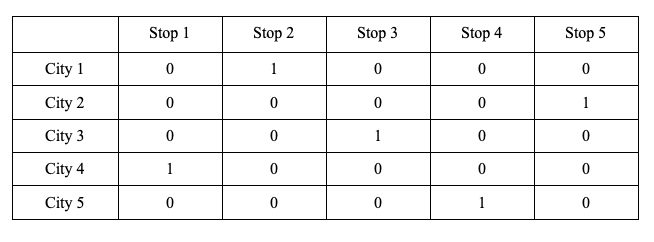
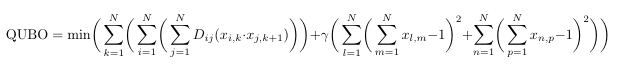

# Covid-19 Vaccine Distribution Optimization

Franck N. Belemkoabga, Ritik Patnaik, Shayda Moezzi, Sebastian Monsalvo, Sophie Zhang (RS^3)

## Abstract
We are experiencing the first worldwide pandemic the world has seen since the early 1900’s. Due to how advanced science is today, companies were able to produce vaccines meant to combat this pandemic in just 10 months, but this raises another issue–vaccine distribution. This is an optimization problem, which is speculated to be exponentially faster to solve through the use of quantum annealing technology, compared to running it on a classical computer. We were able to develop a Quadratic Unconstrained Binary Optimization (QUBO) which promises to find the most optimal route between a given set of cities so that vaccines can be distributed the fastest possible to the people that need it the most.

## Motivation and Goals
One of the biggest supply chain optimization problems of our generation is vaccine distribution, which is now more prevalent than ever before. Since the death toll due to the COVID-19 virus is increasing rapidly, it is imperative to distribute vaccines optimally and in an orderly fashion. Given a list of cities and the distances between each pair of cities, the goal is to find the shortest possible route that visits each city exactly once and returns to the distribution center.  The Travelling Salesman Problem (TSP) is a common optimization problem that can help find the shortest possible route. In addition, there are many other constraints to take into account such as how many vaccines can be shipped at a time, what temperature do the vaccines have to be stored at, and the expiration time of the vaccine.

The computational intensity of the TSP grows exponentially as more cities are added to the list. Using classical computers, solving this problem will eventually become infeasible. Quantum annealing technology, however, has the potential to solve this problem at an increased scale, as the bias and coupling constraints on the qubits creates an energy landscape and enables a much faster determination of the solution. Due to superposition of information, quantum annealing technology can consider a wide array of possible routes simultaneously, thereby making data processing more efficient.

## Description

The problem space, in this case large scale vaccine distribution to hospitals/nursing homes/etc., can be represented as an objective and constraint function in the form of a Quadratic Unconstrained Binary Optimization (commonly referred to as QUBO). One can then map this to the Quantum Processing Unit (QPU) on a quantum computer, which in turn uses quantum annealing to find low energy states of the objective function, representing the optimal solution to our problem. 

As previously mentioned, the QUBO has two components: the objective and constraint function. Our objective is to optimize the route that connects all the cities the hypothetical truck or plane is taking. On the other hand, the constraints are that the distributor can visit a city once, taking edges to get to the city and to leave the city no more than once. In addition, to deter from any multi-cycle solutions, stop constraints are defined so that the distributor can visit only one city at a particular stop. Thus, if the distributor has to visit 5 cities, then it needs to take 5 unique stops to reach each city. This is based on Andrew Lucas’s binary permutation matrix idea shown below, where the route described is city 4 → city 1 → city 3 → city 5 → city 2:

It is important to note that our model calculates the route based on the edge cost of all the edges (connections) possible between cities. The edge cost of the edges connecting to or from a city is dependent on the risk factor, which is simply a predetermined calculated value for each city which determines how much a given city needs vaccines.

Mathematically, the QUBO looks as follows:

We implemented the QUBO for a D-Wave hybrid solver in tsp.py and compared it to a brute-force classical method in brute_force_tsp.py, where it is O(n!). As a benchmark the runtime for the quantum implementation is a second for 10 nodes, while it takes 6 seconds on the brute force method.

## Future Work
So far our model works for finding the fastest route between a given set of cities with the given constraints above. Currently, someone has to manually input the coordinates and cost of passing through the edges in order to get an output. Our hope is that in the future the edge cost corresponding to the edges of a given city can be set to be a variable dependent on the risk factor of that city. This way, one would only have to input the risk factor of all the cities instead of having to calculate and input the edge cost of all the edges–which grow exponentially with respect to the number of cities in the network.

Method 1: Choose highest risk factor nodes/cities, then optimize route using TSP
Method 2: Knapsack (weight = max distance, value = number of vaccines needed/risk factor), then TSP
Method 3: determine clusters of cities, choose which cluster based on average risk factor, then use TSP to travel within cluster
Method 4: purely TSP

# References

https://medium.com/@michal.stechly/solving-the-traveling-salesman-problem-using-quantum-computer-bb00438de223

https://www.scientificamerican.com/article/the-covid-cold-chain-how-a-vaccine-will-get-to-you/

https://www.cdc.gov/vaccines/covid-19/info-by-product/pfizer/index.html

https://www.rocketcitynow.com/article/news/health/coronavirus/vaccine/verify-how-long-does-it-take-for-the-covid-19-vaccines-expire/283-01e27612-0b23-4f3f-9e2f-f94a3ba6be19

https://en.wikipedia.org/wiki/Quadratic_unconstrained_binary_optimization

https://tdem.maps.arcgis.com/apps/webappviewer/index.html?id=3700a84845c5470cb0dc3ddace5c376b
